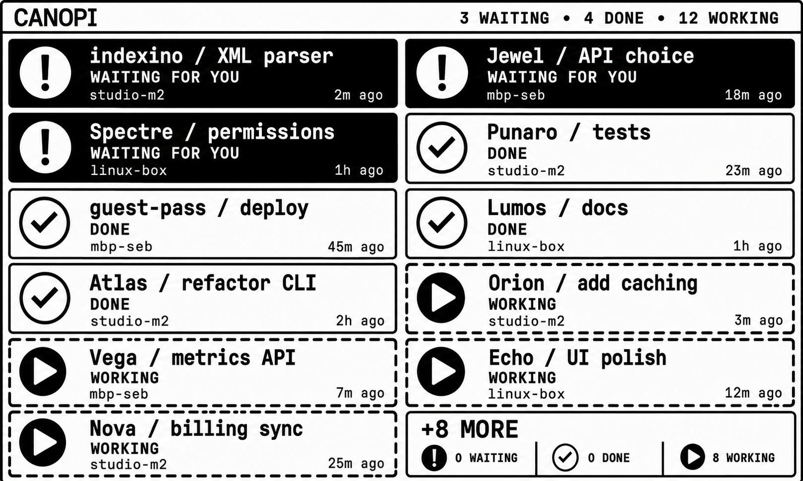
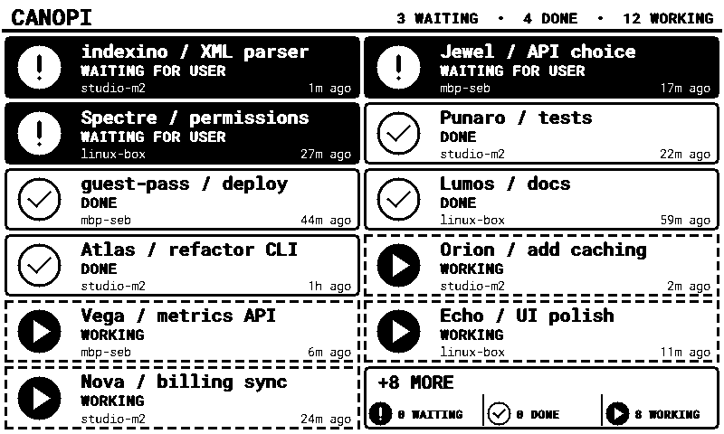

# Canopi coding-agent dashboard MVP

Canopi is a provisional name for Punaro's “what are my agents doing?” feature.
It is implemented inside Punaro because Punaro already owns the cross-machine,
operator, identity, and deployment seams the feature will eventually use. The
MVP remains independently deployable: the protocol, provider mapper, collector,
renderer, simulator, and panel firmware do not depend on Punaro mailboxes or
message types.

## Visual direction

The selected concept establishes the monochrome hierarchy, card treatments,
status symbols, density, and typography direction:



The MVP recreates that direction with deterministic layout, embedded fonts,
one-bit-safe drawing, and live lifecycle data. It does not display or embed the
mock-up in the generated panel image:



See the [visual implementation QA](../design-qa.md) for the normalized
pixel-for-pixel comparison and remaining P3 observation.

## Architecture and boundaries

```text
provider command hook -> bounded recoverable local spool -> detached retry worker
                                                         -> POST normalized event
                                                         -> Canopi collector/state file
                                                         -> deterministic 800x480 PNG
                                                         -> XIAO conditional GET/panel
```

- `canopi/protocol` is the versioned transport-neutral contract.
- `cmd/canopi` is the collector, durable current-state store and renderer host.
- `cmd/canopi-claude-hook` is the first real provider adapter.
- `cmd/canopi-sim` emits 19 realistic agents across three machines and moves
  one agent between working and permission-waiting with current activity times
  on successive ticks. Each process run scopes its event IDs independently.
- `firmware/canopi-panel` is the XIAO ESP32-C3 panel client.

Card identity is `(source, machine.id, agent_instance_id)`. Delivery is
at-least-once. Duplicate event IDs are harmless, and older updates lose to
`activity_at`, then lexicographically to `event_id` on equal timestamps. The
durable JSON snapshot retains the bounded dedupe window across collector
restarts. Non-terminal agents expire instead of becoming successful; terminal
agents have an independent retention period.

The collector sorts the complete state set as waiting, done, working, and then
by descending activity time inside each state. Only after sorting does it apply
grid capacity. The fixed renderer supports one or two columns and one through
six rows, rejecting shapes too narrow or short for its typography and overflow
summary. When there is overflow, the last slot replaces one agent and reports
counts from the omitted tail, not global totals.

## Privacy and failure behavior

Wire and raw Claude hook input must use valid UTF-8 and paired Unicode scalar
escapes before JSON decoding, so malformed identifiers cannot be normalized
into colliding replacement-character strings. The wire
event never requires prompts, transcripts, assistant messages,
credentials, tool inputs, or tool outputs. Metadata is default-deny; the schema
and Go validator accept only the privacy-safe `hook`, `simulated`, and
`agent_type` keys, with the same per-key types as the published JSON Schema.
The Claude adapter does not inspect assistant text to infer lifecycle state. It
creates a random, fixed-length 256-bit invocation identifier that is independent
of both the bearer credential and the provider payload. A collector or token
holder therefore cannot use an event ID to test guesses about private hook
content. Only task title,
optional repository, stable IDs, state, timestamps, and primitive allowlisted
metadata leave the machine. Metadata may be omitted, while explicit JSON `null`
is rejected to match the schema's object contract.

The hook-facing Claude process performs no network I/O. It normalizes raw input
only in memory and writes only the privacy-safe event to the local spool. The
complete event inode is hard-linked into its final queue name before any
uncancellable file or directory sync begins. If Claude terminates a hook while
sync is stalled, or the detached supervisor cannot be launched, that published
target remains recoverable. The continuously managed supervisor reopens and
re-syncs both the file and directory before any delivery attempt. Raw provider
input is never placed in an argument, environment variable, spool file, or
network request. One cross-process worker drains the bounded 4,096-event spool and
retries the queued event with its original ID until the collector acknowledges
it. Separate identical provider invocations receive distinct IDs. Individual
HTTP attempts are bounded, and a rejected event remains queued without starving
independent events behind it. A crashed worker leaves its events queued and its
kernel-held lock is released automatically. Enqueue, drain, and supervisor locks
cannot be reclaimed from a live process by stale timestamps or wall-clock jumps.
A concurrent enqueue waits for the live kernel lock and completes its bounded
primary-lane publication for up to 250 ms. If contention outlives that bound, it
atomically claims one of the capacity-reserved, fsynced contention slots instead
of remaining behind the primary lock or dropping the event. Collector
network I/O remains detached and never occurs while the enqueue lock is held.
Missing configuration, malformed provider input, spool or process-launch
failure, token-file failure, network failure, and collector rejection all leave
the coding agent unblocked and produce no provider-visible output.

All collector routes require the same bearer token. The protected token file
contains one visible-ASCII token line (with an optional final LF or CRLF).
Bodies, batches, headers,
dedupe memory, and grid capacity are bounded. Loopback may use HTTP. A
non-loopback listener must be a concrete private/link-local IP, requires
`--allow-lan`, and requires a TLS certificate and private key; wildcard,
public, and plaintext LAN binds are rejected. The TLS private key is loaded
through the same no-follow, stable-identity, current-user-only checks as the
bearer token before the server starts; `ServeTLS` never reopens its path. The
token path must name a current-user-owned regular file
with owner-only access (or an equivalent protected current-user ACL on Windows);
symlinks and files replaced during open are rejected. The collector, Claude
adapter, and simulator all use this same protected loader. Adapter and simulator
origins likewise require HTTPS except for HTTP to a literal loopback address,
and bearer-authenticated requests never follow redirects.

## Run the vertical slice

Create a private token and choose absolute paths:

```sh
umask 077
openssl rand -hex 32 > /absolute/private/canopi.token
```

Run the collector on loopback:

```sh
go run ./cmd/canopi \
  --listen 127.0.0.1:8090 \
  --token-file /absolute/private/canopi.token \
  --state-file /absolute/private/canopi-state.json
```

For a deliberately selected LAN address, add `--allow-lan`, replace the
listener with that concrete private IP, and provide absolute
`--tls-cert-file` and `--tls-key-file` paths. LAN clients must use HTTPS and
verify that certificate. Useful configuration flags are
`--columns`, `--rows`, `--working-ttl`, `--done-retention`,
`--max-live-records`, `--max-state-bytes`, `--max-future-skew`,
`--relative-time-bucket`, and `--title`. Grid dimensions are constrained to 1–2
columns and 1–6 rows so every accepted shape remains legible on the fixed panel.
New agent identities are rejected at the configured live-record ceiling, while updates to known
identities remain admissible. Activity times beyond the configured
future-clock-skew window are rejected before they can fence later correct
updates or evade expiry. Expired records are durably purged using the real
current time before capacity admission and reads, independently of the
relative-time render bucket. An offline panel therefore cannot leave the store
stuck at its ceiling. Expiry is transactional: if its state-file update fails,
the acknowledged record remains visible under the unchanged revision. Admission
checks a configured aggregate serialized-state budget before acknowledging an
event, and startup rejects a larger state file before allocating or decoding it.
Oldest dedupe IDs are evicted as needed while the newly acknowledged ID is
always retained; record data that cannot fit is rejected transactionally.
Snapshot JSON is bounded by that same state invariant. Each serialized
state update also reclaims crash-left snapshots in a namespace derived from that
state file before writing a new temporary, without touching another collector's
state-file namespace in the same directory. The state path must be absolute and
clean. Its parent is current-user-owned and owner-only; an existing state file
must be a stable, singly linked, current-user-owned `0600` regular file. Windows
uses protected current-user-only DACLs and no-reparse opens for the equivalent
directory and file checks. Windows replacement creates a durable hard-link
backup of the prior state, publishes the flushed replacement with write-through
move semantics, flushes the directory, and recovers the backup on startup if an
interrupted replacement left the target absent. Every later replacement first
recovers or clears a leftover backup, so a failed flush or cleanup cannot wedge
subsequent ingestion. A kernel-held lifetime lock per
state path rejects overlapping collector writers and is released by `Close` or
process exit. The collector canonicalizes and pins the state file's parent
directory before locking, recovery, reads, and every later replacement, so
retargeting an ancestor symlink cannot divert persistence away from the locked
identity. Windows resolves that parent by handle and preserves its case for I/O,
while a separately case-folded value collapses extended device paths, short
names, case variants, and directory aliases for lock naming. Unix resolves all
parent symlinks. The state file itself remains subject
to the no-link checks above rather than resolving a file link to its target.
The predictable state-lock file itself is created exclusively and opened without
following links; an unsafe pre-existing entry is removed, directory-synced, and
recreated with current-user-only protection. Cross-process repair is serialized
by the parent-directory kernel lock on Unix and a no-reparse, current-user-only
coordinator file inside the protected state directory on Windows before the
entry is rechecked and unlinked. Its byte-range lock crosses Windows sessions
without exposing a publicly claimable named mutex. That coordinator is created
with its private DACL atomically; an unsafe pre-existing coordinator fails
startup for explicit operator removal instead of recursively repairing itself.
Every server exit, including a signal or unexpected listener failure, waits for
`http.Server.Shutdown` to finish draining active handlers before `Store.Close`
releases that lifetime lock, fencing rolling restarts until every acknowledged
write from the old collector has completed. The drain has no timeout that could
release the lock while a persistence handler remains active.

In another terminal, generate the selected 3 waiting / 4 done / 12 working
overflow state:

```sh
go run ./cmd/canopi-sim \
  --endpoint http://127.0.0.1:8090 \
  --token-file /absolute/private/canopi.token
```

One-shot mode is `--once`. On a transient delivery failure, the continuous
simulator retries the exact pending batch and event IDs before advancing its
state. For a mixed `207` response, it retains and retries only the rejected
events. Inspect the normalized snapshot or image with:

```sh
CANOPI_TOKEN="$(cat /absolute/private/canopi.token)"
curl -H "Authorization: Bearer $CANOPI_TOKEN" \
  http://127.0.0.1:8090/v1/snapshot
curl -H "Authorization: Bearer $CANOPI_TOKEN" \
  -o canopi.png \
  http://127.0.0.1:8090/v1/render/800x480.png
```

The supported endpoints are `POST /v1/events`, `POST /v1/events:batch`,
`GET /v1/snapshot`, and `GET /v1/render/800x480.png`. Both GET routes return
ETags and honor `If-None-Match` with a body-free 304. Snapshot validators are
weak and revision-stable despite its current generation timestamp; image ETags
are strong hashes of deterministic PNG bytes. A structurally valid batch
continues after per-event admission failures and returns `207` with an ordered
status/result entry for every event, so one permanent rejection cannot starve
later lifecycle updates. Persistence failure still fails the request.
The batch body must be a JSON array; `null`, trailing JSON, oversized arrays,
and invalid members fail without false acknowledgement.
An already-durable duplicate event ID is acknowledged before timestamp-skew
validation, so an exact retry remains idempotent even after a clock correction.

## Claude Code adapter

The adapter was validated against Claude Code 2.1.197 and the corresponding
first-party hook reference. It consumes the common `session_id`, `cwd`, and
`hook_event_name` fields plus current event-specific fields:

- `PermissionRequest` -> waiting / permission;
- `Elicitation` and input-requiring `Notification` variants -> waiting;
- `ElicitationResult` -> working, clearing the completed wait;
- prompt, tool, batch, session and subagent-start activity -> working;
- `Stop` and `SubagentStop` -> done;
- `TaskCompleted` is ignored because the current hook lacks a separately
  addressable Canopi task/agent identity.

Only explicit, trusted hook fields drive lifecycle state; assistant text never
does. When display labels are derived because optional configuration is absent,
the adapter truncates them rune-safely to the protocol bounds.

Build the adapter and export its small, non-secret configuration in the shell
that launches Claude Code:

```sh
go build -trimpath -o /absolute/bin/canopi-claude-hook ./cmd/canopi-claude-hook
export CANOPI_ENDPOINT=https://canopi.example.internal:8443
export CANOPI_TOKEN_FILE=/absolute/private/canopi.token
export CANOPI_SPOOL_DIR=/absolute/private/canopi-claude-spool
export CANOPI_MACHINE_ID=studio-m2
export CANOPI_MACHINE_LABEL=studio-m2
export CANOPI_TASK_TITLE='Punaro / current task'
export CANOPI_REPOSITORY='rock3r/punaro'
/absolute/bin/canopi-claude-hook prepare
```

Copy the `hooks` object from
`canopi/providers/claude-code-hooks.example.json` into project-local
`.claude/settings.local.json` or the desired Claude settings scope, then replace
the absolute binary path. Run `prepare` before enabling those hooks; it creates
and protects the spool before provider hooks can publish events. Hook stdout and
stderr stay empty.

`CANOPI_SPOOL_DIR` is optional; when omitted, `prepare` creates
`canopi-claude-spool` beside the token file. On Unix, the directory must belong
to the current user and is tightened to mode `0700`; on Windows, it must belong
to the current user and is given a protected current-user-only DACL. Queued
normalized events are owner-only. A collector outage never causes the
hook-facing process to wait for network recovery. If a filesystem sync outlives
Claude's hook timeout, the event target was already published and the persistent
supervisor completes its durability barrier. The adapter applies the same current-user,
owner-only, regular-file, no-symlink token checks as the collector. Each
serialized enqueue reclaims crash-left `.event-*.tmp` files while holding the
cross-process kernel lock, keeping temporary storage bounded across restarts.
Enqueue, drain, and supervisor locks are tied to open file handles; the kernel
releases them on process exit, and wall-clock jumps cannot reclaim a live holder.
Queued files are inspected and decoded through the 64 KiB stream limit, so a
corrupt oversized spool entry is removed without an unbounded allocation.
Every queued child is also opened without following links and must remain a
private current-user-owned regular file across the open; entries planted before
the spool directory was tightened are discarded before capacity accounting or
delivery rather than authenticated to the collector. Newly enqueued files receive
the same protection before publication.
The fixed enqueue, drain, and supervisor lock names use create-exclusive and
no-follow opens with the same ownership and privacy validation. Unsafe entries
left from a previously shared directory are removed, directory-synced, and
replaced instead of permanently blocking the adapter. Repair is serialized by
the parent-directory kernel lock on Unix and a no-reparse, current-user-only
coordinator file inside the protected spool on Windows. Its byte-range lock
crosses Windows sessions without exposing a publicly claimable named mutex, so
concurrent hooks cannot unlink each other's replacement locks even when a
service and interactive agent run in different sessions. The coordinator is
created atomically during `prepare`; an unsafe pre-existing coordinator makes
preflight fail for explicit operator removal instead of repairing its own lock.
The configured spool capacity includes a fixed contention reserve (one sixteenth,
at least one and at most 256 slots). Normal and contention lanes therefore remain
jointly bounded while concurrent hooks can make progress independently.
Directory creation and ACL protection happen only during the explicit `prepare`
preflight or supervisor startup, never during hook-facing publication. All
cancellable enqueue work is capped at 1.75 seconds; complete target publication
precedes the two uncancellable durability barriers.
Each operation resolves the configured spool to a canonical real directory for
its full lifetime. Current-user-owned Unix symlink ancestors and all Windows
reparse ancestors are rejected, preventing a mutable alias from splitting hooks
and the persistent supervisor across different queues.
The primary phase defaults to 250 ms and is capped at 750 ms; cleanup and capacity
scans use cancellable 128-entry batches, and an
exhausted primary budget immediately falls through to the contention reserve.
Active contention temporaries hold kernel locks, so cleanup
can reclaim crash leftovers without deleting an in-progress publication. A
fallback starts under a pre-lock staging name that ordinary cleanup ignores and
renames into the cleanup namespace only after acquiring its kernel lock.
Pre-lock crash remnants become reclaimable after one minute.

Run the durable worker as a continuously supervised companion using the same
environment (for example with `Restart=always`/`KeepAlive` in the host service
manager):

```sh
/absolute/bin/canopi-claude-hook supervise
```

Hooks also kick-start this singleton worker opportunistically. The persistent
supervisor is the durable wake path: it keeps polling an empty spool, retries
collector outages, and is restarted by the service manager if the worker
crashes, so the final event of a quiet session does not depend on a later hook.

## Pi evaluation

Pi 0.84.2 type definitions were inspected directly rather than copied from the
handoff. They expose `session_shutdown`, `agent_start`,
`agent_end`, `agent_settled`, `turn_start`, `turn_end`, `tool_call`,
`tool_result`, and tool-execution events.

`hsingjui/pi-hooks` was reviewed at commit
`8250a856d4f892f0a8a640ac2f1241d1a000701b` (package version 0.0.1). It is a
good reuse path for this MVP's `SessionStart`, `UserPromptSubmit`, tool, `Stop`,
and `SessionEnd` command hooks, and its `Stop` payload includes
`last_assistant_message`. It does not map Pi permission UI or notification
events, supports command hooks only, and implements stop control best-effort.
Therefore the next Pi slice should pin that reviewed commit for working/done
reuse, then add a very small native Pi extension only if accurate
waiting-for-user signals are required. Do not fork a full bespoke hook bridge.

The protocol already reserves `pi`, `codex`, and `grok_build` sources, so those
adapters need no collector changes.

## Panel firmware and exact hardware verification

The source targets Seeed's XIAO 7.5-inch monochrome ePaper Panel: XIAO
ESP32-C3, UC8179, 800x480, `BOARD_SCREEN_COMBO 502`. It uses the official
Seeed_GFX API and PNGdec. Dependency commits are pinned in `platformio.ini`.
Arduino ESP32 2.0.17 requires Espressif GCC 8.4's `rv32imc/ilp32` multilib.
The handoff's native GCC 12 workaround compiled, but its selected `libgcc`
contained an `frrm` instruction that the integer-only ESP32-C3 cannot execute,
causing a trap during Wi-Fi setup.
PlatformIO's registry package for GCC 8 is x86_64 on this Apple Silicon Mac, so
the project installs Espressif's official matching macOS arm64 archive and
verifies its published SHA-256. The assembler is explicitly kept on the legacy
RISC-V 2.2 ISA model while `-march=rv32imc` selects the no-FPU multilib.

The upload path also pins Espressif OpenOCD 0.12.0-esp32-20260703. PlatformIO's
2022 OpenOCD could attach to this XIAO but could not probe its flash when the
e-paper board affected the ESP32-C3 strap pins. The pinned release contains
Espressif's strap-safe C3 flasher fix. Both tools are installed locally and
gitignored; no Rosetta installation is required.

The client connects to Wi-Fi, obtains a valid wall clock from NTP, then uses
HTTPS to validate the collector certificate against its configured CA. It does
not send the bearer token until clock synchronization succeeds. It sends the
retained ETag and does nothing on 304. A 200 response must be `image/png`, have a bounded known length,
decode successfully, and report exactly 800x480 before `epaper.update()` runs.
Each decoded RGB565 scanline is thresholded and packed MSB-first into the
Seeed_GFX one-bit sprite; RGB565 bytes must never be passed directly to its
one-bit `pushImage` path.
The new ETag is retained only after a successful full display refresh. USB mode
polls every 20 seconds. Optional battery mode sleeps for three minutes by
default; the ETag is retained in RTC memory. A versioned cache invalidates that
retained validator after a firmware change that requires the panel to redraw.

Physical verification:

1. Run Canopi on a concrete private LAN address with `--allow-lan`,
   `--tls-cert-file`, and `--tls-key-file`; start the simulator with the HTTPS
   collector URL, and verify from another LAN machine that the render URL
   returns a 1-bit 800x480 PNG and an ETag with valid certificate verification.
2. Copy `firmware/canopi-panel/include/secrets.example.h` to `secrets.h` and set
   Wi-Fi, the HTTPS LAN render URL, the same token, and the PEM CA certificate
   that issued the collector certificate. The real file is gitignored.
3. Connect the panel by USB-C. Keep it USB-powered for the MVP. If the panel was
   assembled separately, seat the fragile FPC with metal contacts facing up.
4. On Apple Silicon, from `firmware/canopi-panel`, run
   `./install-toolchain-macos-arm64.sh` once. It downloads the exact GCC and
   OpenOCD archives, verifies both SHA-256 values, and prints their versions.
5. Run `platformio run`, then `platformio run --target upload`, then
   `platformio device monitor --baud 115200`. Upload uses the XIAO's built-in
   JTAG, so the BOOT button is not required. If the board does not start after
   JTAG reset, fully cycle its power; switching or cycling USB is not a cold
   cycle while a connected battery and its switch keep the board powered.
6. Confirm serial output reports `clock synchronized` before the first HTTPS
   request. If it times out, allow DNS and NTP from the panel network before
   diagnosing the collector certificate.
7. Confirm the first fetch performs exactly one full refresh and the displayed
   layout matches `artifacts/canopi-implementation.png` without clipping,
   rotation, grey pixels, or missing rows.
8. Leave state unchanged for at least two 20-second polls. The screen must not
   flash or refresh; the server response is 304 because the firmware sends
   `If-None-Match`.
9. Change one simulated agent. Confirm one refresh within 20 seconds, a new
   ETag, and no additional refresh on the following unchanged poll.
10. Stop simulator updates and wait past `--working-ttl`; confirm non-terminal
   cards disappear rather than becoming done. Leave a done card past
   `--done-retention` and confirm it disappears independently.

The one-bit packing build was flashed to the physical XIAO panel through
built-in JTAG and exercised end to end. The TLS follow-up was compile-verified;
its image used 87,292 of 327,680 RAM bytes and 939,830 of 1,310,720 flash bytes.
Disassembly of the flashed build confirmed the linked image contains no
floating-point CSR instructions. Serial evidence showed a successful validated
display refresh, repeated body-free 304 responses with no display update,
further refreshes after the simulator changed lifecycle state, and 304
responses again after the simulator stopped. Flash the TLS image only after
configuring the operator's real CA certificate and HTTPS collector URL.

Deployment-specific SSIDs, credentials, network names, firewall identifiers,
client addresses, and host addresses are intentionally excluded from the
repository. Operators should substitute their own concrete private addresses
and enforce the narrowest route from the panel network to the collector's TCP
listener.

## Renderer provenance

The deterministic renderer embeds Roboto Mono Regular and Bold from the
official repository at commit `895ec691990d041dd727c7b5afa3ce56525d98e6`
under the bundled SIL Open Font License. SHA-256:

- Regular: `af0bff7599c3df3831755c16e39b3c496df74b8c8d8a1161b14dc8461be17cb4`
- Bold: `3ecf35e5e87accc7578b605d1f5f0bc30d88b195d6807bec8a0c57f6aa95c4db`

Text is rasterized server-side, thresholded into a two-entry palette, and PNG
encoded deterministically. The panel never displays the selected mock-up.
