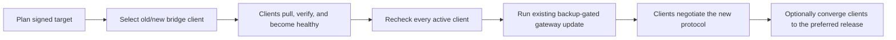

# Client lifecycle, compatibility, and recovery RFC

Status: proposed design for the first named release (2026-08-10). It is not an
implemented or released security boundary. Acceptance requires corresponding
updates to `DESIGN.md`, tests, release gates, and operator documentation.

Implementation is intentionally incremental. Database schema 44 and the first
server-side bearer-client lifecycle sub-slice implement authoritative client
records, derived endpoint namespaces, owner inventory/revocation, and narrow
self-revocation. Supported invitation consumption and crash-safe client
credential persistence are implemented. The explicit trusted-LAN profile now
binds plaintext permission and a private/link-local CIDR independently on the
server and native relay clients. Exact legacy authority import, protocol
negotiation, signed updates, and recovery remain outstanding.

In this RFC, **gateway** means the central Punaro installation and `punarod`
service. The optional Telegram bridge remains a separately enrolled client.

## Decisions

1. The host-local installation owner may invite, inspect, and revoke any
   client without a second authentication system. There is no remote admin
   enrollment API.
2. Client enrollment uses the existing short-lived, single-use, high-entropy
   code. Punaro does not add a shared installation password or a custom
   password challenge protocol.
3. A client may revoke only the credential authenticating that request. It
   cannot name, invite, update, or revoke another client.
4. Product release, wire protocol, release-metadata schema, bootstrap protocol,
   and database schema are separate version axes.
5. Every normal client performs an authenticated hello and supplies the
   selected wire protocol on later requests. No compatible protocol means a
   fail-closed `426 Upgrade Required`, not a legacy fallback.
6. Client updates are pull-based. The gateway selects a signed release; it
   never supplies an arbitrary executable, command, or download URL.
7. A gateway upgrade first moves every active client onto a bridge release
   compatible with both the old and new gateway protocols.
8. A small `punaro-bootstrap` executable owns signed-artifact verification,
   release slots, child-process health, rollback, and recovery. It does not
   read Punaro content, authorize messages, open PostgreSQL, or run migrations.
9. Critically outdated software enters a recovery-only mode. The recovery
   surface exposes signed public release metadata and no Punaro data or
   control-plane mutation.
10. Every named release publishes an offline recovery bundle. Online recovery
    is a convenience, not the only path back to a supported version.
11. First-release device credentials do not expire automatically. Compromise,
    loss, and retirement use permanent revocation followed by a fresh
    invitation; expiring credentials and online renewal are deferred.

## Existing foundation

This design extends current contracts rather than creating parallel ones:

- `punaro client add` already creates a bounded, preview-confirmed enrollment
  with a ten-minute default lifetime.
- Redemption already derives one retry-recoverable device credential from a
  256-bit one-time code and stores only its digest.
- Credentials already carry a generation fence; generation changes and owner
  revocation invalidate cached and long-lived sessions within two seconds.
- The host-local owner can list content-free credential metadata.
- Gateway release metadata already binds an immutable OCI digest, database
  compatibility range, rollback floor, Compose digest, and migration-manifest
  digest.
- `punaro update` already owns the database maintenance fence, verified backup,
  migration authorization, candidate readiness, and compatible-image or
  restore recovery boundary.

The missing pieces are the supported client-side enrollment UX, self-revocation,
wire negotiation, signed native artifacts, fleet rollout coordination, and an
update path that survives normal-protocol incompatibility.

## Goals

- Onboard and revoke macOS, Linux, Windows, and Telegram clients without
  editing gateway configuration by hand.
- Ensure one compromised client credential cannot manage any other client.
- Detect version skew before normal operations begin and return an actionable,
  machine-readable result.
- Move all active clients through a compatible bridge before changing the
  gateway protocol. An active client has an enabled installation and at least
  one current, non-revoked credential.
- Recover a client whose normal protocol no longer overlaps the gateway.
- Recover a gateway whose current operator or image is too old to reach the
  desired release directly.
- Preserve credentials, client queues, deduplication state, and gateway data
  across software replacement.
- Keep the release trust and recovery plane small enough to audit and exercise.

## Non-goals

- Remote gateway administration, an enrollment web console, or enrollment by
  Telegram message.
- Automatic creation or revocation of Cloudflare Access service tokens.
- Transparent rolling upgrades or zero downtime for a single-node gateway.
- Remote attestation that proves an honest client is running particular bytes.
- Keeping every historical messaging protocol enabled forever.
- A general package manager or arbitrary plugin updater.
- Password-authenticated key exchange, mTLS PKI, or a full TUF implementation
  for the first named release.

## Trust boundaries

| Actor | Authority |
| --- | --- |
| Host-local owner | Invite, list, revoke, plan fleet rollouts, and run the existing gateway update transaction. Compromise is installation compromise. |
| Gateway daemon | Redeem stored invitations, authenticate devices, negotiate protocols, publish desired signed releases, and record content-free fleet status. It cannot sign releases. |
| Client credential | Exercise only its granted Punaro capabilities, report its own runtime state, and revoke itself. |
| `punaro-bootstrap` | Install only signed Punaro artifacts from fixed sources or an explicit local bundle, switch local slots, launch children, and roll back. |
| Release signing key | Authorize exact public release catalogs, manifests, and artifacts. Compromise permits malicious Punaro code until the operator completes out-of-band re-key recovery; it does not directly authorize Punaro data access. |
| Cloudflare Access | Optional ingress admission only; it remains independent of Punaro enrollment and revocation. |

A compromised gateway may deny service or withhold updates, but it must not be
able to make an honest bootstrap execute unsigned bytes. A compromised client
may impersonate that client until revocation; it must not be able to create an
invitation, alter a rollout, or revoke another credential.

A compromised release-signing key is a fleet code-execution incident, not an
ordinary rotation. An attacker holding it can authorize malicious Punaro bytes,
including an apparently valid transition bootstrap. Automatic recovery cannot
distinguish that from an honest release. Recovery therefore requires an
independently obtained bootstrap digest and host-local or OS-level replacement;
systems that already executed malicious signed bytes may require full host
reinstallation and fresh enrollment of every potentially exposed client.

## Client lifecycle

### Invitation

The supported owner command becomes conceptually:

```text
punaro client invite --name NAME --machine-id ID
                     (--project ID ... | --all-projects)
                     [--ttl 10m]
                     [--output PROTECTED_FILE]
```

The existing grant preview and exact preview-hash confirmation remain. Host
ownership is the administrator authentication boundary; the confirmation is a
safety check, not a second identity factor.

The invitation document is versioned and contains only:

```json
{
  "schema": 1,
  "origin": "https://punaro.example",
  "enrollment_id": "uuid",
  "client_binding": "uuid",
  "code": "base64url-256-bit-secret",
  "expires_at": "RFC3339 timestamp"
}
```

The gateway remains authoritative for the label, machine ID, derived exclusive
`agent/<machine-id>/` endpoint namespace, and grants. Exact legacy endpoints
require a separate explicit owner option and never imply a prefix. The client
cannot supply or widen any of these at redemption. The code is shown once,
stored only as a digest by the gateway, and never accepted in a command-line
argument. The CLI may write a new `0600`/exclusive-ACL file or print to an
interactive terminal; automation uses a protected file or standard input.

The full invitation is the magic link. A shorter human transcription code may
be added later only if it still provides at least 128 bits of entropy. A
six-digit OTP would require a separate tightly rate-limited exchange and is not
part of the first release.

The resulting device credential has no automatic expiry in the first named
release. It remains current until permanent owner or client self-revocation.
This intentionally avoids a credential-expiry state from which an offline or
protocol-stranded client could neither authenticate nor recover. Routine online
credential renewal is deferred until it can be specified and tested with
lost-response recovery; suspected exposure uses revoke and fresh enrollment.

### Client redemption

```text
punaro-bootstrap enroll --invite-file FILE
punaro-bootstrap enroll --invite-file -
```

The bootstrap validates the fixed HTTPS origin, invitation schema, expiry, and
local destination before calling the existing strict
`POST /v1/enrollments/redeem` route. It chooses one UUID idempotency key and
retains it until the response is durably committed. An exact retry must recover
the same credential after a lost response.

The credential is written atomically beneath the platform's existing protected
client directory. The invitation secret is removed only after the credential
and installed identity metadata are durable. Installation does not enable the
adapter until an authenticated hello succeeds.

No remote request can create an invitation. A client can redeem only an
already approved invitation, and redemption always creates the principal bound
to that credential; it cannot name an existing or different client.

Redemption also atomically creates the server-authoritative client installation
record. That record binds one opaque client ID and device principal to the
unique machine ID, endpoint prefix, optional exact endpoints, and lifecycle
state. Runtime endpoint authorization comes from that record under the same
current credential-generation fence; a friendly machine ID or client-supplied
prefix is never authority. PostgreSQL replaces `PUNARO_RELAY_MACHINES_JSON` as
the named-release authority after the legacy migration below is complete.

### Inventory and owner revocation

```text
punaro client list
punaro client revoke --client UUID
                     --reason lost|retired|compromised|replaced
```

Inventory is bounded and content-free: client ID, machine ID, assigned endpoint
namespace, principal ID, credential lookup ID, label, generation, release,
protocol range, selected protocol, platform, bootstrap version, last successful
hello, last credential use, rollout state, and revocation timestamp. It
contains no live endpoint inventory, bodies, credential digest, Access token,
or private host detail.

One client installation has exactly one current credential in the first named
release. Owner revocation is permanent and idempotent. It revokes the client
installation and credential together, advances the credential and principal
fences, closes long-lived sessions within the existing two-second bound, and
retains the principal, audit event, and rollout history. Rejoining uses a fresh
invitation, client ID, and credential; revocation is never cleared in place.
Cloudflare token revocation remains a separate operator action.

### Client self-revocation

An authenticated client receives one narrow route:

```text
POST /v1/device/session/revoke
Authorization: Bearer <current credential>
Idempotency-Key: <uuid>
Content-Length: 0
```

The request contains no target identifier. The server obtains the client,
credential lookup ID, and generation only from authentication and atomically
revokes that exact client installation and credential. The transaction advances
the same client, credential, principal, and endpoint-authority fences as owner
revocation and closes long-lived sessions within the existing two-second bound.

The credential row retains a bounded revocation idempotency key. The narrow
route may verify an already-revoked credential only to return the exact prior
successful self-revocation result for the same key; it grants no normal API
access and discloses no credential state. This makes a lost success response
recoverable without creating a temporary post-revocation session.

This revoked-credential verification is scoped to this handler and can never
create or populate a normal authenticated request context. The first committed
revocation wins. If owner revocation won the race, the credential has no prior
self-revocation result and a later self-revocation attempt fails uniformly as
unauthenticated. It does not replace the owner reason or write a second audit
event. If self-revocation won, only its exact idempotency-key retry succeeds.

After confirmed revocation, the bootstrap stops managed processes, retires the
local credential, and preserves queues as operator-recoverable local data. It
does not silently delete unsent messages or mailbox state.

### Legacy Ed25519 migration

Existing adapters are authenticated by an Ed25519 key whose static gateway
enrollment also owns their machine ID and endpoint namespace. The first named
release must not silently reinterpret or discard that authority.

The migration imports each reviewed static enrollment into a disabled
server-authoritative client installation record and links it to the existing
legacy principal/public-key digest. The owner then issues an enrollment for
that exact legacy client. Redemption requires both the one-time code and the
existing proof-of-possession exchange; it creates the bearer credential and
activates the imported client record without changing its machine ID, prefixes,
exact endpoints, or grants.

During the bridge window, the global legacy gate permits either the existing
signed request or its exactly linked replacement credential to select that one
client record. New clients receive bearer credentials only. Inventory reports
each legacy record as `pending`, `migrated`, or `retired`. After every record is
migrated or explicitly retired, the owner runs the existing one-way legacy
disable operation. The gateway then removes the static JSON authority and
refuses any Ed25519 request permanently. Reopening that gate requires restore
of an earlier verified installation, not a configuration toggle.

### Persistent model

The implementation adds bounded records equivalent to:

- `auth.client_installations`: opaque client ID, immutable machine ID and
  label, device principal, lifecycle state, created/revoked timestamps, and
  revocation reason code;
- `relay.client_endpoint_authority`: client ID, the one derived endpoint
  prefix, optional bounded exact endpoints, and authority generation;
- the existing `auth.device_credentials`, extended with a unique current-client
  binding and bounded self-revocation idempotency result;
- `jobs.client_runtime_status`: latest content-free hello/update report keyed
  by client ID and current credential generation;
- `jobs.fleet_rollouts`: immutable plan hash, signed source/bridge/target
  release identities, state, and timestamps; and
- `jobs.fleet_rollout_clients`: rollout/client/generation snapshot and one
  bounded reported state.

Machine ID uniqueness makes the derived `agent/<machine-id>/` namespaces
disjoint. Exact endpoint uniqueness is checked while the same bounded authority
mutation lock is held. Activated machine IDs, prefixes, client IDs, and
principal bindings are immutable; changing one means revoking and enrolling a
new client rather than retargeting existing authority.

Enrollment creates the principal, credential, client record, endpoint
authority, grants, audit event, and change sequence atomically. Revocation
locks and advances the same client, credential, principal, and endpoint
authority generations before committing one content-free audit event. The
application role reaches these tables only through bounded store transactions
and column-exact grants; ordinary client status reports cannot mutate identity
or endpoint authority.

## Version model

| Axis | Example | Meaning |
| --- | --- | --- |
| Product release | `v0.2.0` | Human-facing gateway/client bundle release. |
| Wire protocol | `2` | HTTP and WebSocket semantics shared by gateway and clients. |
| Release metadata | `1` | Strict signed manifest and signature-envelope schema. |
| Recovery/bootstrap | `1` | Frozen minimal recovery descriptor understood by the bootstrap. |
| Database schema | `44` | Client-lifecycle PostgreSQL migration/compatibility boundary. |

SemVer never determines wire or database compatibility. Compatibility comes
only from the signed release manifest and the gateway's implemented protocol
range.

Within one wire protocol, changes must be additive: optional response fields,
new optional capabilities, or new routes that old clients do not use. Changing
the meaning or required shape of an existing operation requires a new protocol
integer. A gateway supports at least the current and immediately previous
protocol until the fleet has crossed the corresponding bridge release.

## Authenticated hello

Before normal HTTP work and before opening a notification WebSocket, a client
sends a bounded strict request:

```text
POST /v1/hello
Authorization: Bearer <device credential>
Content-Type: application/json
```

```json
{
  "schema": 1,
  "client_kind": "adapter",
  "client_release": "v0.2.0",
  "protocol": {"min": 1, "max": 2},
  "capabilities": ["fleet-update-v1", "websocket-hello-v1"],
  "platform": {"os": "darwin", "arch": "arm64"},
  "bootstrap": {"release": "v0.1.0", "recovery_protocol": 1},
  "artifact_sha256": "hex-sha256"
}
```

The gateway selects the highest overlap and replies:

```json
{
  "schema": 1,
  "gateway_release": "v0.3.0",
  "gateway_protocol": {"min": 2, "max": 3},
  "selected_protocol": 2,
  "required_capabilities": ["websocket-hello-v1"],
  "update": {
    "policy": "required",
    "release": "v0.3.0-bridge.1",
    "sequence": 18,
    "manifest_sha256": "hex-sha256"
  },
  "recovery_path": "/.well-known/punaro-recovery/v1"
}
```

`update.policy` is the closed enum `none`, `optional`, or `required`. For
`none`, the update object contains only `policy`. For `optional` and `required`,
`release`, `sequence`, and `manifest_sha256` are all required. An optional
update does not block normal operations. A required update closes normal
operations after hello and permits only the bounded update-status and
self-revocation routes until the selected signed release becomes healthy.

The client must implement every returned `required_capabilities` value before
normal operations or a notification WebSocket begin. A missing capability fails
closed with the same structured upgrade response; unknown required capability
strings are never ignored.

The hello body is at most 8 KiB. It has at most 64 unique capability strings,
each at most 64 ASCII characters. OS, architecture, and client kind are closed
enums. Unknown fields, duplicate fields, invalid ranges, and noncanonical
release or digest values are rejected.

Every later HTTP request carries `Punaro-Protocol: N`. The first WebSocket
client frame repeats the hello schema and the server must acknowledge the
selected protocol before sending hints. Missing or unsupported protocol values
fail before request-body processing.

If there is no overlap, or the signed release policy marks the reported release
critically outdated, the gateway returns `426 Upgrade Required` with a fixed
problem code, its protocol range, and the fixed relative recovery path. Normal
operations remain closed. Claimed client release and artifact hashes are
operational evidence only; the server never relaxes authorization because a
client claims a newer version.

A client without protocol overlap cannot use the authenticated self-revocation
route because hello precedes normal authenticated work. The host-local owner
revocation command is the deliberate revocation path for such a stranded client;
recovery does not create a legacy authentication exception.

## Signed release contract

Each named release publishes an exact detached-signature pair:

- `punaro-release.json`
- `punaro-release.sig`

Each Ed25519 signature covers the exact manifest bytes. The strict signature
envelope has schema `1`, a bounded key ID, and at most four unique signatures,
which permits a dual-signed key transition. Verification occurs before manifest
JSON parsing. Parsing then rejects duplicate and unknown fields. There is no
JSON reserialization or home-grown canonicalization step.

The immutable release manifest contains:

- metadata schema, monotonically increasing release sequence, release name,
  and publication time;
- gateway and client wire-protocol ranges;
- minimum recovery protocol and bootstrap release;
- the existing database schema minimum, maximum, target, rollback floor,
  PostgreSQL major, image digest, Compose digest, and migration-manifest digest;
- a bounded artifact list with component, OS, architecture, relative path,
  byte length, mode, and SHA-256;
- the releases from which a direct update is supported; and
- an optional signed stepping-stone sequence for older supported installations.

A separately signed, short-lived release catalog lists the current release
manifests, minimum safe sequences, and critical-release blocks. It has no key
delegation. Online update and automatic recovery require a fresh catalog. This
lets Punaro retire a vulnerable release without making the immutable manifest
itself unverifiable years later.

Artifact paths are relative names beneath a fixed configured release origin.
They cannot contain a scheme, host, credentials, query, fragment, empty path
component, or `..`. The gateway may select a release and mirror its signed
bytes, but cannot change the origin or authorize a URL.

A bootstrap honors a gateway-selected release only when a fresh verified
catalog contains the exact release sequence and manifest digest and does not
critically block it. A signed manifest by itself proves artifact identity, not
that the release is still allowed for an automatic update.

The first release uses one offline Ed25519 release key whose public key and key
ID are embedded in the bootstrap. The catalog and every release manifest are
signed independently by that same key. A bootstrap accepts each document only
when at least one envelope signature verifies against a public key embedded in
that bootstrap; catalog contents never grant manifest-signing authority.

Routine key rotation requires a transition bootstrap plus catalog and manifest
envelopes signed by both old and new keys. An old bootstrap verifies the old
signature, the transition installs a bootstrap embedding the new key, and later
releases may be new-key-only. Rotation is not an ordinary gateway setting. The
private key is not committed or placed in an ordinary CI secret. The approved
release process signs the final catalog and manifest after CI has produced the
exact artifact hashes, then publishes the catalog, manifest, signatures,
artifacts, SBOM, provenance, and release evidence together.

Key-compromise recovery never trusts a transition authorized only by the
compromised key. The operator obtains an emergency offline bundle and expected
bootstrap SHA-256 through independent official channels, stops Punaro, and runs
the host-local `punaro-bootstrap recover rekey --bundle FILE
--expected-bootstrap-sha256 HEX` flow. That flow verifies the typed digest before
installing a bootstrap containing the replacement key, records a content-free
re-key event, and then verifies the bundled catalog, manifests, and artifacts
only with the replacement key. It is never gateway-triggered or automatic. If
the current bootstrap or host may already have executed attacker-signed code,
the safe procedure is OS-level reinstall followed by credential replacement,
not in-place recovery.

The bootstrap durably records the highest accepted release and catalog
sequences. Normal gateway-directed updates cannot move backward. A signed
downgrade is available only through an explicit host-local recovery command
and still must satisfy the current wire/database compatibility boundary.

## Bootstrap and client slots

Platform services launch `punaro-bootstrap run`, not a versioned adapter binary
directly. The bootstrap has a deliberately narrow standard-library-oriented
surface:

- verify signed release manifests and exact artifact length/digest;
- stage only a closed list of Punaro component filenames;
- maintain `current`, `candidate`, and `previous` release records under the
  existing private client directory;
- write a crash-recoverable content-free update journal;
- start the selected child with the existing protected configuration;
- wait for a bounded local healthy/handshake signal; and
- atomically publish or roll back a slot.

Slot records are private regular files published with atomic rename and parent
directory synchronization; symlinks, junctions, reparse points, hard-linked
credentials, and writable ancestors are rejected. No slot contains a device
credential, Access token, mailbox database, queue, or deduplication journal.
At most two completed release slots plus one bounded candidate are retained.

The bootstrap never accepts a shell command, installer script, environment
assignment, arbitrary filename, or post-install hook from release metadata.
Platform-specific service definitions are fixed bootstrap-owned templates. A
candidate must report a successful authenticated hello within 60 seconds and
remain alive for the configured health window before publication. Failure
restores the previous slot once only when the fresh signed catalog still allows
that release and its protocol overlaps the observed gateway. Otherwise, or
after repeated failure, the bootstrap enters recovery-only mode rather than a
restart loop.

Self-update of the bootstrap uses the frozen recovery protocol and a separately
identified bootstrap artifact. The old bootstrap verifies and stages the new
binary before a small platform-specific handoff. If it cannot understand the
required recovery protocol, it stops with the exact offline-bundle instruction.

## Fleet rollout

The gateway stores only content-free rollout coordination:

- desired signed release, sequence, and manifest digest;
- target gateway release and protocol range;
- each active credential lookup ID and generation in the rollout cohort;
- reported client release, protocol range, selected protocol, bootstrap
  release, artifact digest, and last hello time; and
- one bounded state: `pending`, `offered`, `downloading`, `staged`,
  `restarting`, `healthy`, `failed`, `offline`, or `revoked`.

Client status updates are authenticated, strict, idempotent, and may update only
the caller's row. They are operational reports, not authorization or remote
attestation.

The owner workflow is:

```text
punaro client rollout plan --gateway-release RELEASE
punaro client rollout start --plan-hash SHA256
punaro client rollout status --rollout UUID
```

Planning loads signed metadata for the current gateway, target gateway, and
available client releases. It must find a bridge client whose protocol range
overlaps both gateways. If none exists, planning fails before changing desired
state.

Starting snapshots every active credential. A client enrolled during an active
rollout inherits the desired bridge release and joins the cohort. Gateway
publication rechecks all current active credentials, not only the original
snapshot, so a concurrent enrollment cannot create a compatibility hole.

The gateway update remains blocked until every cohort member is `healthy`, has
a fresh authenticated hello, and overlaps the target gateway protocol. An
offline client remains visibly pending; timeout never silently excludes or
revokes it. The operator may wait or explicitly revoke a retired/lost client.

The final cohort evaluation is part of the existing maintenance-fence and
gateway-update transaction, not a check performed before it. That transaction
locks a monotonically increasing client-registry epoch, re-reads every active
credential, and refuses publication unless each row satisfies the gate.
Enrollment redemption may prepare records while the fence is held, but client
activation and any credential-generation change serialize on the same epoch and
cannot commit between the final check and gateway publication. Failure releases
the fence without publishing either the gateway or a partial cohort decision.

The rollout sequence is:



Before an incompatible database migration, the gateway may return to the old
image and every bridge client must still work. After that boundary, the
existing fenced compatible-image or verified-backup recovery rules remain
authoritative. Fleet coordination cannot bypass or clear the database update
fence.

## Recovery-only mode

### Frozen public recovery surface

Every gateway release serves:

```text
GET /.well-known/punaro-recovery/v1
```

This route requires no Punaro credential, is cacheable for a short bounded
period, and is content-free. Optional outer Cloudflare admission and origin
isolation remain in force; upstream and offline recovery remain available when
that admission path is unavailable. The route returns either the signed
release manifest bytes or a fixed descriptor containing only the gateway
release, gateway protocol range, release sequence, manifest digest, and fixed
same-origin manifest path. It contains no client inventory, installation ID,
database schema, desired per-client policy, hostname inventory, credential
material, or arbitrary URL.

Public recovery makes an incompatible client repairable when normal device
authentication or wire semantics have changed. It grants no normal route and
is bounded and rate-limited. Artifacts normally come from the fixed release
origin; an optional gateway mirror serves only exact signed artifacts with
declared size ceilings.

### Critically outdated client

On `426`, repeated candidate failure, a corrupt current slot, or a critical
signed release block, the bootstrap:

1. disables normal child restart loops;
2. loads the frozen recovery descriptor from the gateway, configured release
   origin, or explicit offline bundle;
3. verifies the signed catalog and chooses the newest bridge release that
   overlaps the observed gateway protocol;
4. verifies and stages exact platform artifacts;
5. starts the candidate and requires an authenticated hello; and
6. publishes it or returns to recovery-only mode with a content-free error.

If no signed bridge supports the observed gateway, client recovery stops and
reports that the gateway requires host-local recovery. It never enables an
obsolete unauthenticated messaging protocol merely to regain connectivity.
Revoked credentials cannot enter this flow; the owner must issue a fresh
invitation after recovery if the installation is meant to rejoin.

### Critically outdated gateway

Gateway recovery does not require `punarod` to be running:

```text
punaro-bootstrap recover gateway --directory DIR --release RELEASE
punaro-bootstrap recover gateway --directory DIR --bundle FILE
```

The bootstrap validates protected installation metadata and signed release
metadata, then selects a signed `punaro` operator binary capable of the current
release/database boundary. If the target cannot be reached directly, it
constructs an acyclic stepping-stone plan of at most 16 releases from signed
manifests. Ambiguous edges, cycles, gaps, or a longer path are a hard refusal.

For each step, the selected `punaro` operator—not the bootstrap—runs the
existing preflight, maintenance fence, verified backup, one-shot migration,
candidate readiness, doctor, publication, and recovery transaction. The
bootstrap records only which signed operator step is active and resumes that
exact step after a crash. It never opens PostgreSQL, edits a migration record,
guesses that a failed external action succeeded, or starts an obsolete writer
against newer state.

Corrupt or incompatible database state is not repaired by installing a newer
binary. Recovery remains fenced and follows the existing verified-backup
restore workflow into safe paths.

### Offline recovery bundle

Every named release publishes one signed bundle containing:

- the frozen recovery descriptor;
- the current release catalog and detached signature;
- release manifest and detached signature;
- bootstrap artifacts for the declared platform matrix;
- client artifacts;
- gateway/operator artifacts or exact OCI digest declarations;
- Compose and migration-manifest hashes;
- the finite supported stepping-stone manifests; and
- a human-readable recovery summary with no secrets.

The bundle contains no installation configuration, credential, database,
message, backup, or mutable URL. Extraction validates every path before writing
and verifies exact size and SHA-256 before publication. An offline exercise
must succeed with network access disabled. Because a bundled catalog may have
expired after publication, offline use requires the explicit host-local
`--allow-stale-catalog` acknowledgement already defined below; staleness never
relaxes catalog/manifest signatures, release-sequence checks, artifact bounds,
or artifact digests.

## Failure and security rules

- Invitation, hello, status, manifest, and recovery decoders reject unknown and
  duplicate fields and enforce explicit body, list, string, and concurrency
  bounds.
- Enrollment and self-revocation are idempotent across lost responses and
  restart boundaries.
- Revoked or superseded generations cannot report status, receive desired
  releases, or retain WebSocket sessions beyond the existing revalidation
  bound.
- No Telegram or agent message body can invite, revoke, update, recover, or
  select a release.
- The gateway never returns a bearer credential, invitation code, Access token,
  release private key, message body, or raw update failure in logs or status.
- Catalog expiry prevents an untrusted mirror from indefinitely replaying an
  old signed policy. Clock failure produces an explicit recovery diagnostic;
  it does not disable signature or sequence checks. Explicit offline recovery
  may accept an expired signed catalog only with a host-local
  `--allow-stale-catalog` acknowledgement; it never disables artifact signature
  or digest verification, and a sequence downgrade needs a separate explicit
  acknowledgement.
- A gateway may require an update from an honest client, but claimed version
  metadata never substitutes for server-side authorization or input validation.
- Local downgrade and restore commands are explicit, host-local, and preserve
  the current database compatibility and backup fences.
- Suspected release-key compromise stops automatic updates. Recovery requires
  the independently verified host-local re-key procedure or an OS-level
  reinstall; a gateway-selected or old-key-only transition is refused.

## Implementation slices

Each slice is independently reviewable and follows the repository's test-first
and full-quality-gate requirements.

1. **Lifecycle completion:** server-authoritative client/endpoint records,
   supported invitation consumption, bounded owner inventory/revoke CLI,
   self-revocation route/store, exact legacy import/exchange/disablement, and
   Unix/Windows failure tests. No updater yet.
2. **Wire contract:** strict hello, `Punaro-Protocol` enforcement, WebSocket
   hello/ack, structured `426`, content-free runtime inventory, and mixed-range
   contract tests.
3. **Release trust:** extend current release metadata into the detached-signed
   manifest, offline signing/publishing tooling, native artifact matrix, strict
   parser/fuzz corpus, sequence/expiry checks, SBOM/provenance binding, and
   routine key-rotation plus compromised-key out-of-band recovery drills.
4. **Client bootstrap:** private slot/journal format, download bounds, digest
   verification, platform service handoff, candidate health, crash recovery,
   and one-slot rollback on macOS, Linux, and Windows.
5. **Fleet bridge rollout:** desired release/status stores, plan hash, cohort
   fencing, new-enrollment behavior, offline/revoked handling, and a real
   multi-client old-gateway/bridge/new-gateway E2E.
6. **Disaster recovery:** frozen public recovery surface, critical-client
   recovery, signed stepping-stone planner, gateway operator handoff, and
   network-disabled offline-bundle drills.
7. **Named-release gates:** fresh enrollment, self- and owner revocation,
   protocol incompatibility, bridge rollout, failed client candidate rollback,
   critically outdated client, critically outdated gateway, database recovery,
   routine signing-key transition, compromised-key recovery, and
   supported-platform evidence.

## Rejected alternatives

- **Shared gateway enrollment password:** easy to explain, but every client and
  every copied configuration becomes authority to enroll more clients. A
  single-use invitation has a smaller blast radius and already exists.
- **Custom password challenge/response:** adds cryptographic protocol and
  dependency risk without improving a high-entropy one-time token sent over
  validated TLS.
- **Gateway-pushed binaries or commands:** makes gateway compromise a remote
  code-execution signing authority. The gateway may choose only a separately
  signed release identity.
- **Update gateway first and hope clients follow:** strands sleeping or offline
  clients. A bridge release keeps rollback and reconnect deterministic.
- **Silently ignore offline clients:** makes `update-all` untrue and creates
  latent incompatibility. The operator must wait or explicitly revoke them.
- **Keep every old protocol enabled:** expands the permanent attack surface and
  prevents retiring known-bad implementations. The frozen recovery plane is
  the long-lived compatibility contract instead.
- **Put database migration logic in the bootstrap:** duplicates the existing
  durable updater and makes the supposedly stable rescue component understand
  every schema. The bootstrap selects a signed compatible operator; the
  operator owns database safety.

## First named release exit criteria

The first named release is withheld until reviewable evidence proves:

- invitation redemption, lost-response retry, owner revocation, self-revocation,
  owner/self race replay, cache/session closure, and fresh re-enrollment;
- exact static-enrollment import, legacy proof-bound exchange, unchanged
  endpoint authority, explicit retirement, and irreversible legacy-gate
  disablement;
- strict protocol negotiation, closed update-policy decoding, missing-required-
  capability refusal, and fail-closed normal operations with no overlap;
- signed artifact rejection for wrong key, altered bytes, wrong platform,
  rollback sequence, expiry, path traversal, truncation, and oversized input;
- client candidate crash/restart recovery and previous-slot rollback on every
  supported platform;
- a bridge rollout across at least two real clients, including one temporarily
  offline client and one revoked client;
- gateway update refusal until every active client is compatible, including an
  enrollment racing the final fenced cohort check;
- critically outdated client recovery through the frozen endpoint;
- critically outdated gateway recovery through at least one stepping stone;
- network-disabled offline recovery for both one client and one gateway using
  the bundled signed catalog, including explicit stale-catalog handling;
- routine dual-signed key transition and independently verified compromised-key
  re-key recovery; and
- the existing backup, migration, restore, SBOM, scan, signed-tag, and release
  evidence gates for the exact candidate artifacts.
